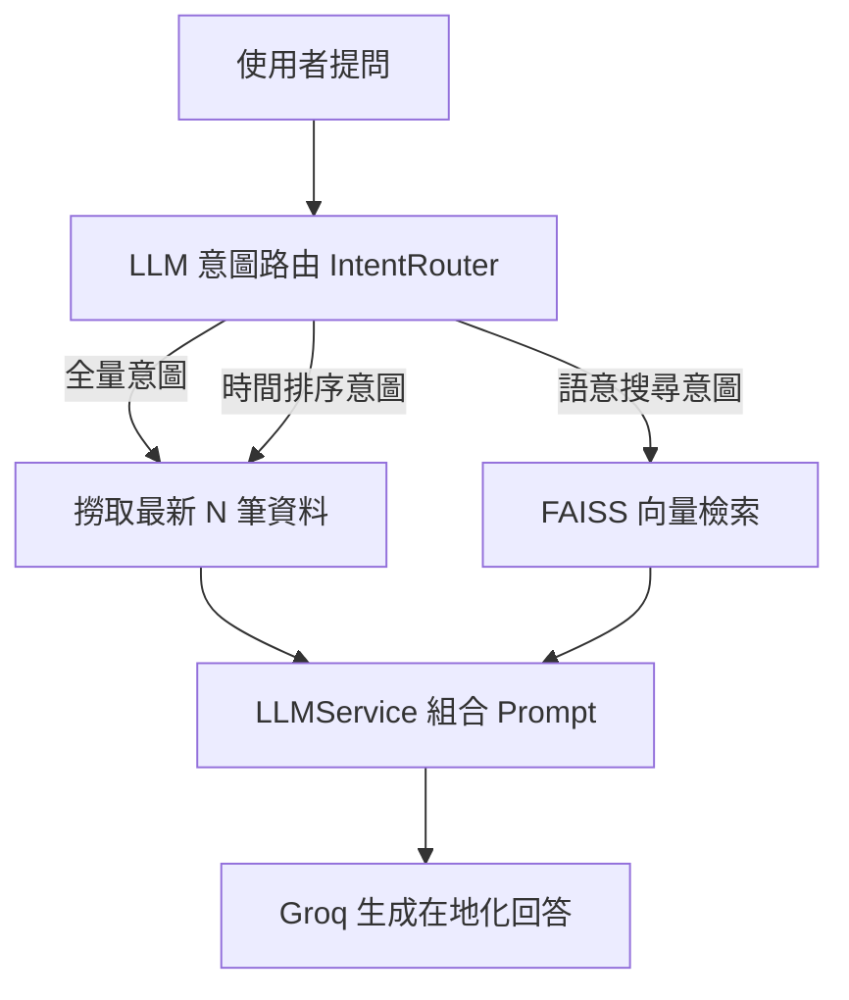

# 🏋️ RAG 健身建議系統

> 本地隱私檢索 + 多模型支援生成的 AI 健身建議系統

基於 **RAG（Retrieval-Augmented Generation）** 架構，將你的健身訓練紀錄向量化後存於本地 FAISS 索引，提問時透過語意搜尋找出最相關的紀錄，再由 Groq 雲端 LLM 生成專業回答。

## ✨ 特色功能

- 🔒 **隱私優先**：資料切塊與向量搜尋 100% 在本地執行，可運用本機 GPU (CUDA) 加速
- 🧠 **自動語意切塊 (Semantic Chunking)**：放棄傳統固定字數，採用 LangChain SemanticChunker 結合語意演算法智慧切割文檔。
- 📚 **多元文件支援**：輕鬆吞入並解析純文字 (`.txt`) 或排版複雜的英文/中文 PDF 文檔 (`.pdf`)。
- 🧭 **LLM 意圖路由 (Intent Routing)**：採用 LLM 結構化輸出 (Structured Output) 判讀意圖，智能導流至全量統計、時間排序、或語意向量搜尋。
- ⚡ **極速生成與防爆機制**：支援動態 Token 保護策略 (Strategy A/B) 預防免費金鑰超過 Payload 限制。
- ⚙️ **動態設定面板**：在 Streamlit 側邊欄即可隨時安插新的 API Key，隨意抽換底層驅動模型。
- 🧱 **SOLID 解耦與多模型支援**：導入依賴反轉 (DIP) 與工廠模式 (Factory Pattern)，系統可無縫在 Groq, OpenAI 與 Ollama (本地離線模型) 間靈活切換，改寫核心不必更動商業邏輯。

## 🛠️ 技術堆疊

| 元件 | 技術 |
|------|------|
| 框架 | [LangChain](https://python.langchain.com/) |
| 向量化模型 | [BAAI/bge-small-zh-v1.5](https://huggingface.co/BAAI/bge-small-zh-v1.5)（~90MB） |
| 向量庫 | [FAISS](https://github.com/facebookresearch/faiss)（CPU） |
| 雲端 LLM | [Groq](https://groq.com/)、[OpenAI](https://openai.com/) |
| 本地 LLM | [Ollama](https://ollama.com/) |
| 後端 API | [FastAPI](https://fastapi.tiangolo.com/) |
| 前端介面 | [Streamlit](https://streamlit.io/) |


## 📁 專案結構

```
rag-fitness-coach/
├── data/
│   ├── Train.txt            # 你的健身紀錄（文字格式）
│   ├── *.pdf                # 你的參考書籍與教練手冊（PDF 格式）
│   └── faiss_index/         # FAISS 索引（由 indexer 產出）
├── src/
│   ├── api/                 # FastAPI 伺服器端點 (endpoints, server)
│   ├── config/              # 環境變數與全域設定 (settings)
│   ├── models/              # Pydantic 資料綱要 (schemas)
│   ├── services/            # 核心商業邏輯 (llm_service, intent_router, vector_service, embedding_service)
│   ├── indexer.py           # 向量化與建立 FAISS 索引的 ETL 腳本
│   └── app.py               # Streamlit 聊天介面
├── main.py                  # 啟動 FastAPI 與 Streamlit 的主程式
├── .env.example             # 環境變數範本
├── requirements.txt
└── README.md
```

## 🚀 快速開始

### 1. 安裝依賴

```bash
pip install -r requirements.txt
```

### 2. 設定環境變數

```bash
cp .env.example .env
# 編輯 .env，填入你的 Groq API Key
```

> 前往 [Groq Console](https://console.groq.com/) 免費取得 API Key

### 3. 準備你的訓練紀錄

將你的健身紀錄或參考書籍放入 `data/` 資料夾，目前支援：
- **純文字 (.txt, .json)**：例如傳統用 Line 紀錄的訓練日誌。
- **文件檔案 (.pdf)**：自動使用 PyPDF 提取並拆解內容。

放入資料夾後，系統會自動幫你執行 Token 向量化。

### 4. 建立索引

請使用 module 模式執行，以確保 Python 能夠抓到模組路徑：

```bash
python -m src.indexer
```

### 5. 啟動服務

我們提供了一個主要入口 `main.py`，可以直接同時啟動 FastAPI 後端與 Streamlit 前端：

```bash
python main.py
```

打開瀏覽器前往 `http://localhost:8501` 即可使用。

## 💬 使用範例

| 問題 | 檢索策略 |
|------|----------|
| 我壓肩做過最重幾公斤？ | FAISS 語意搜尋 |
| 最近 5 筆訓練紀錄 | 時間意圖 → 日期排序 |
| 我的胸推有進步嗎？ | FAISS 語意搜尋 + 趨勢分析 |
| 幫我安排下次的腿部訓練 | FAISS 語意搜尋 + 訓練建議 |

## 📐 架構圖



## 🌟 開發史：`llm-function-routing` 分支演進

本分支實現了專案從「簡易 MVP 腳本」跨入「企業級架構」的三大重構里程碑：

1. **模組化重構 (Modular Architecture)**
   - 將原本肥大的單一檔案拆分為標準 `src/` 領域驅動架構 (`api`, `services`, `models`, `config`)。
   - 全面改採 Pydantic 管理資料綱要，並實作單例模式 (Singleton) 服務降載。
2. **導入意圖路由 (LLM Intent Routing)**
   - 捨棄死板的正則表達式 (Regex) 關鍵字猜測。
   - 導入 LangChain `with_structured_output`，利用 Llama 3 毫秒級智能判斷「時間」、「統計」與「語意搜尋」意圖，甚至自動提煉英文/中文搜尋關鍵字。
3. **GPU 解析與防爆機制 (GPU Semantic Chanking & Payload Limits)**
   - 擴充 `pypdf` 支援，成功匯入數千頁厚重的原文生物力學與教練手冊。
   - 捨棄固定字數切割，升級為 **LangChain SemanticChunker**，並結合本機 **NVIDIA GTX 1050 Ti (CUDA 11.8)** 達成極速語意識別與 FAISS 向量建置。
   - 因應免費 API 嚴苛的限制，開發了 Streamlit 設定面板，實作「策略 A (極限省流)」與「策略 B (智慧截斷)」徹底解決 Payload 崩潰問題。
4. **多模型切換工廠 (LLM Factory)**
   - 貫徹 SOLID 依賴反轉原則 (DIP)，將 ChatModel 初始化從核心服務中剝離。
   - 實作工廠模式，支援從 Streamlit 介面一鍵切換 Groq (Llama3)、OpenAI (GPT-4o) 以及 Ollama 本地離線模型。

## 🧩 目前方法與改進方向

### 1. 簡單的提示詞工程

**目前做法**

使用固定的 `SYSTEM_PROMPT`，包含：

- **角色設定**：10 年經驗的專業健身顧問
- **回覆原則**：分析能力、訓練建議、格式規範、安全提醒
- **使用者檔案**：身高體重、訓練目標、飲食偏好等個人資訊
- **回話風格**：親切、專業、有耐心

```python
# 目前結構（簡化示意）
SYSTEM_PROMPT = """
角色：10年專業健身顧問
回覆原則：分析趨勢 / 給建議 / 格式化 / 安全提醒
使用者檔案：姓名、身高、體重、目標...
回話風格：親切、專業
"""
```

**⚠️ 目前限制**

- 使用者檔案寫死在程式碼中，無法動態切換
- 沒有 Few-shot Examples（範例問答）引導輸出格式
- 沒有 Chain-of-Thought（思維鏈）引導推理過程

**🔧 改進方向**

| 改進項目 | 說明 |
|---------|------|
| **Few-shot Prompting** | 在 Prompt 中加入 2~3 組範例問答，讓 LLM 學會格式與推理方式 |
| **動態使用者檔案** | 將使用者資料存入 `config.yaml` 或資料庫，啟動時載入 |
| **Chain-of-Thought** | 要求 LLM 先分析紀錄趨勢，再給出建議，提升回答品質 |
| **Prompt 版本管理** | 使用 LangChain `PromptTemplate` 管理不同版本的 Prompt |
| **多語言支援** | 根據使用者語言偏好動態切換 System Prompt |

---

### 2. 從簡易規則路由邁向「語意路由 (Semantic Routing)」

### 2. 語意路由 (Semantic Routing) 實作機制

**目前做法：基於 LLM 結構化輸出 (Structured Output) 的語意路由**

目前系統已經淘汰了早期的正規表達式 (Regex)，全面升級為由 Llama 3 驅動的**大模型語意分類器**。我們使用 LangChain 的 `with_structured_output` 綁定 Pydantic Schema，要求 LLM 在毫秒間將使用者的每一句話歸類：

```python
# src/models/schemas.py
class RouteDecision(BaseModel):
    intent: Literal["semantic", "temporal", "all"]  # 意圖分類
    n_count: int                                    # 需抓取的數量
    refined_query: str                              # 提煉後的搜尋關鍵字
```

| 偵測到的意圖 | 目前路由路徑 | 範例 |
|------------|------|------|
| 全量意圖 `all` | 回傳所有紀錄 | 「我有幾筆資料」「總共練了幾次」「幫我統計一下」 |
| 時間意圖 `temporal`| 按日期排序取 N 筆 | 「最近 5 筆」「前兩次練什麼」「上禮拜的課表」 |
| 語意搜尋 `semantic`| FAISS 語意搜尋 | 「壓肩怎麼進步」「教我練背的生物力學」 |

**優勢與突破**
- **聽懂弦外之音**：無論使用者怎麼換句話說，LLM 都能透過上下文推斷真實意圖，不再受限於死板的關鍵字觸發。
- **自動摘要關鍵詞**：當使用者問「教練，你可以告訴我上一次做深蹲的時候，大約用了多少重量嗎？」，路由層會自動萃取出乾淨的 `深蹲 重量` 作為精準的 FAISS 向量搜尋關鍵字。

## ⚙️ 自訂設定 / 預防 API Rate Limits

由於我們使用了 Groq 免費方案，有極為嚴格的 TPM (Tokens Per Minute) 和 TPD (Tokens Per Day) 上限：
- **若使用免費金鑰 (`llama-3.1-8b-instant`)**：建議在 Streamlit 前端側邊欄的【檢索策略】選用 **策略 A (極限省流)**，系統會只挑出最精準的 1 筆片段給 LLM 壓縮 Prompt，確保不會觸發 `413 Request Too Large` 錯誤。
- **若使用付費版 (`llama-3.3-70b-versatile`)**：請勾選「💎 這是付費版 API Key」，即可解鎖 **策略 B (智慧截斷)**，享受更寬廣的 TOP_K 上下文脈絡能力與高智商推論。

## 📝 License

MIT
