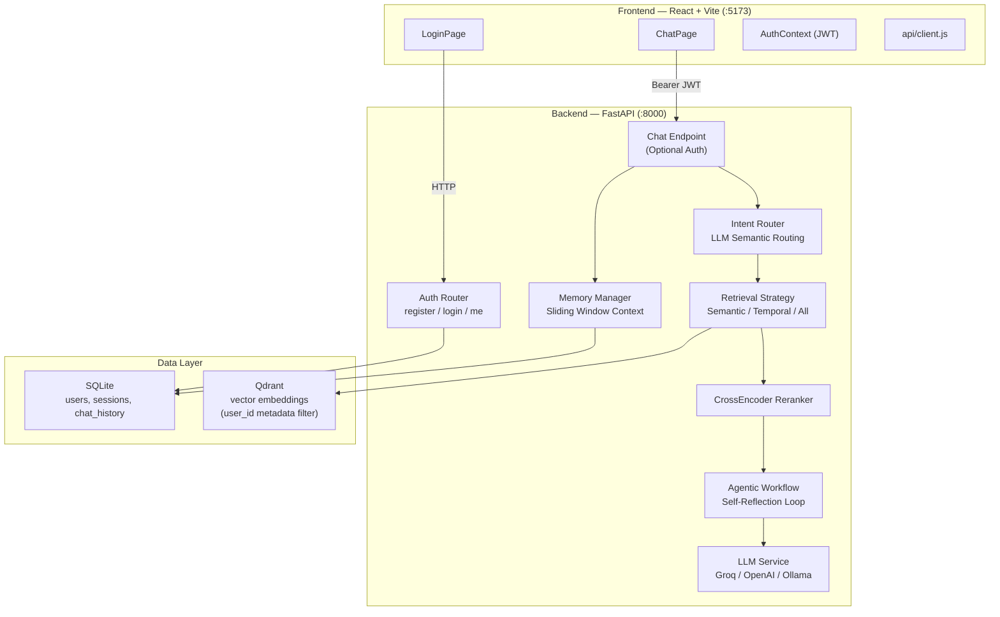
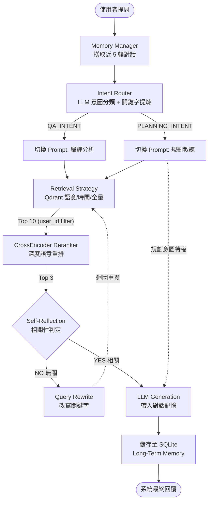
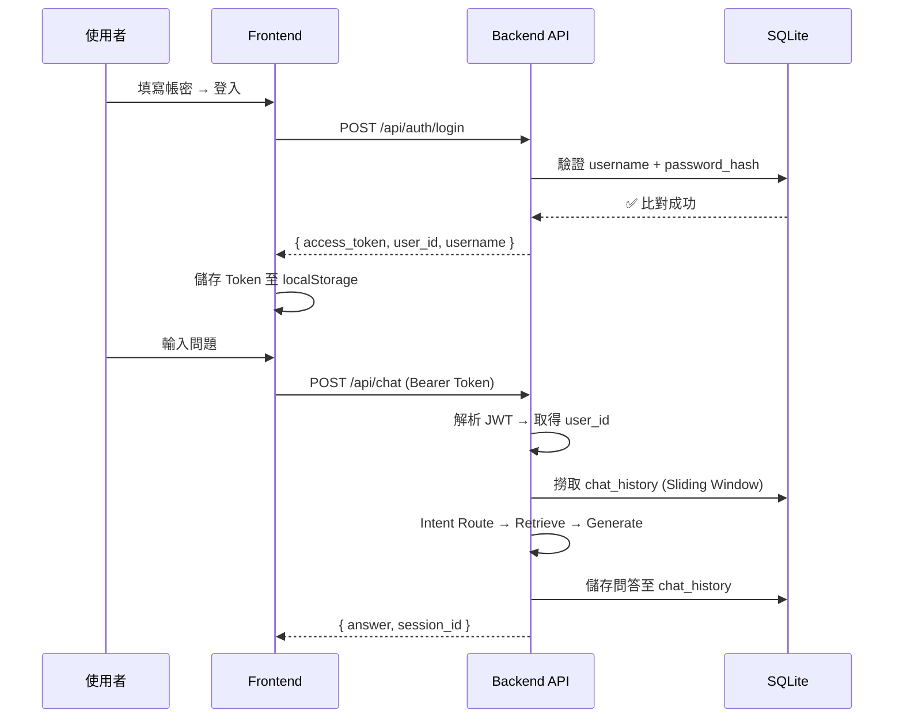
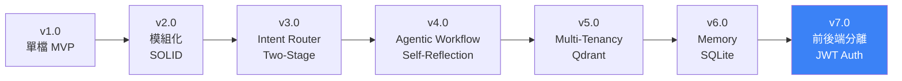

<div align="center">

# 🏋️ FitAI — Agentic RAG 智慧健身教練

**本地隱私 × 雲端推論 × 多租戶隔離 × 前後端分離**

[](https://python.org)
[](https://fastapi.tiangolo.com)
[](https://react.dev)
[](https://python.langchain.com)
[](LICENSE)

</div>

---

## 🎯 Part 1 — 產品經理：這是什麼？解決了什麼問題？

### 問題

市面上的 AI 健身助手，不是把你的私人訓練紀錄傳上雲端（隱私風險），就是只能做通用型問答，根本不認識「你」。使用者需要的是一位 **記得你上個月深蹲多重、知道你的弱項、能幫你規劃下一週菜單** 的 AI 教練。

### 解法

FitAI 是一套以 **RAG (Retrieval-Augmented Generation)** 為核心的 AI 健身顧問系統。它把你的私人訓練紀錄向量化後存在 **本地端**，再透過雲端大型語言模型進行推論，實現 **「資料不出門、智慧從雲來」** 的混合雲架構。

### 核心價值

| 價值 | 說明 |
|------|------|
| 🔒 **隱私優先** | 文檔解析、向量搜尋 100% 在本機跑，你的訓練紀錄不會被第三方看到 |
| 🧠 **記得你是誰** | 導入 SQLite 長期記憶，AI 教練知道你上週聊過什麼、上月深蹲多重 |
| 🏠 **多租戶隔離** | User A 的數據絕對不會被 User B 看見 (Qdrant Metadata Filter) |
| 🎯 **意圖感知** | 不只是 Q&A 機器人——問數據就查數據，要菜單就幫你規劃 |
| 🔌 **前後端解耦** | 後端 FastAPI 純 API、前端 React SPA，未來可直接對接手機 App |

### 使用情境

| 你問 | AI 認知到的意圖 | 系統行為 |
|------|----------------|---------|
| 我上週深蹲做多重？ | `QA_INTENT` → 時間檢索 | 從向量庫撈出最近紀錄，嚴格分析後回覆 |
| 我的胸推有進步嗎？ | `QA_INTENT` → 語意搜尋 | 兩階段檢索 + CrossEncoder 重排，追蹤趨勢 |
| 幫我安排下半身訓練菜單 | `PLANNING_INTENT` | 切換教練 Prompt，結合你的近期實力生成個人化菜單 |
| 那硬舉呢？ | 上下文延續 | 讀取對話記憶，理解省略的代名詞後再次檢索 |

---

## 🏗️ Part 2 — 技術架構師：怎麼做到的？

### 系統架構總覽



### 技術堆疊

| 層級 | 技術選型 | 為什麼 |
|------|---------|--------|
| **前端** | React 19 + Vite + React Router | SPA 架構，熱重載開發，未來可遷移至 React Native |
| **後端 API** | FastAPI + Pydantic | 非同步高效能，自動產出 OpenAPI 文件 |
| **認證** | JWT (python-jose) + SHA-256 (static pepper) | 無狀態 Token Auth，前端 localStorage 持久化 |
| **向量庫** | Qdrant (Local Storage) | 比 FAISS 更強大的 Metadata Filter 實現多租戶隔離 |
| **關聯式 DB** | SQLite | 零設定輕量化，記憶/會話/使用者資料持久化 |
| **Embedding** | BAAI/bge-small-zh-v1.5 (CUDA) | 中文語意最佳化，本機 GPU 加速 |
| **Reranker** | BAAI/bge-reranker-base | CrossEncoder 二次深度打分，抑制雜訊 |
| **LLM** | Groq / OpenAI / Ollama (Factory) | SOLID DIP 工廠模式，一鍵切換 |
| **核心框架** | LangChain | 編排 Structured Output、Prompt Template |

### Agentic RAG Pipeline



### 認證流程



### 專案結構

```
rag-fitness-coach/
│
├── Dockerfile                            # 🐳 多階段建置 (Node→Python, port 7860)
├── .dockerignore
├── .env.example                          # 根目錄環境變數範本 (GROQ_API_KEY)
│
├── data/                                 # 📚 原始訓練資料 (PDF/TXT)
│   ├── *.pdf                             # ACSM、生物力學等健身文獻
│   └── Train.txt                         # 訓練紀錄純文字檔
│
├── backend/                              # 🐍 FastAPI 後端
│   ├── main.py                           # uvicorn 啟動入口 (:8000)
│   ├── requirements.txt
│   ├── .env.example                      # 後端環境變數範本 (GROQ_API_KEY, JWT_SECRET_KEY)
│   ├── data/
│   │   ├── fitai_memory.db               # SQLite (users, sessions, chat_history) [執行時產生]
│   │   └── qdrant_storage/               # Qdrant 向量索引 [執行時產生]
│   └── src/
│       ├── indexer.py                    # 向量索引建置腳本 (python -m src.indexer)
│       ├── api/
│       │   ├── server.py                 # FastAPI app factory (CORS + SPA 靜態檔)
│       │   ├── endpoints.py              # POST /api/chat (Optional Auth)
│       │   └── auth.py                   # POST /api/auth/* (JWT 認證)
│       ├── config/settings.py            # 環境變數與 JWT 設定
│       ├── db/database.py                # SQLite Schema 初始化
│       ├── models/schemas.py             # Pydantic 資料模型
│       └── services/
│           ├── auth_service.py           # 密碼雜湊 + JWT 簽發
│           ├── memory_manager.py         # 對話記憶滑動視窗
│           ├── intent_router.py          # LLM 意圖路由 (Semantic Router)
│           ├── agent_workflow.py         # Agentic RAG 主迴圈
│           ├── llm_service.py            # LLM 回覆生成
│           ├── llm_factory.py            # 多模型切換工廠 (DIP)
│           ├── retrieval_strategy.py     # 檢索策略 (Strategy Pattern)
│           ├── vector_service.py         # Qdrant 向量操作 + 多租戶隔離
│           └── embedding_service.py      # CUDA Embedding 模型載入
│
├── frontend/                             # ⚛️ React + Vite 前端
│   ├── package.json
│   ├── vite.config.js
│   ├── eslint.config.js
│   ├── index.html
│   ├── public/
│   │   ├── favicon.svg
│   │   └── icons.svg
│   └── src/
│       ├── main.jsx                      # 應用程式入口
│       ├── App.jsx                       # React Router 路由設定
│       ├── api/client.js                 # fetch wrapper (自動帶 JWT)
│       ├── context/AuthContext.jsx        # Token 狀態管理 + localStorage
│       ├── assets/                       # 靜態圖片資源
│       ├── pages/
│       │   ├── LoginPage.jsx             # 登入 / 註冊 / 匿名入口
│       │   └── ChatPage.jsx              # 聊天介面 + Markdown 渲染
│       └── styles/index.css              # Glassmorphism 設計系統
│
├── tests/
│   └── evaluate_rag.py                   # RAG 品質評估腳本
│
└── README.md
```

### 核心設計模式

| 模式 | 實作位置 | 說明 |
|------|---------|------|
| **Factory Pattern** | `llm_factory.py` | Groq / OpenAI / Ollama 一鍵切換 |
| **Strategy Pattern** | `retrieval_strategy.py` | Semantic / Temporal / All 檢索策略 |
| **Singleton** | `vector_service.py`, `embedding_service.py` | 避免重複載入 GPU 模型 |
| **Dependency Inversion** | `intent_router.py` → `llm_factory` | 高層模組不依賴低層實作 |
| **Sliding Window** | `memory_manager.py` | 最近 5 輪對話作為 LLM 上下文 |

---

## 🚀 Part 3 — 技術傳教士：如何啟動？如何參與？

### 環境需求

- Python 3.10+
- Node.js 18+
- NVIDIA GPU (有 CUDA 更佳，CPU 也能跑)
- [Groq API Key](https://console.groq.com/) (免費)

### 快速啟動 (3 步驟)

#### 方式 A — 本機開發 (前後端分離)

**Step 1 — 後端**

```bash
cd backend

# 安裝 Python 依賴
pip install -r requirements.txt

# 設定環境變數
cp .env.example .env
# 編輯 .env → 填入 GROQ_API_KEY 和 JWT_SECRET_KEY

# 準備訓練資料 (將 PDF/TXT 放入根目錄 data/ 資料夾)
python -m src.indexer

# 啟動後端 API
python main.py
# → http://localhost:8000
```

**Step 2 — 前端**

```bash
cd frontend

npm install
npm run dev
# → http://localhost:5173
```

**Step 3 — 打開瀏覽器**

前往 **http://localhost:5173** → 註冊帳號 → 開始跟你的 AI 教練聊天！

> 💡 不想註冊？點「🚀 不登入，直接使用」也能用匿名模式問問題。

#### 方式 B — Docker 一鍵部署

```bash
# 在根目錄建立 .env 並填入 GROQ_API_KEY
cp .env.example .env

docker build -t fitai .
docker run -p 7860:7860 --env-file .env fitai
# → http://localhost:7860 (前後端同時 Serve)
```

> Docker 映像採用多階段建置：先用 Node.js 打包前端，再由 Python 映像提供 FastAPI + SPA 靜態檔。訓練資料的向量索引在建置階段自動產生。

### API 端點一覽

| Method | Path | Auth | Description |
|--------|------|------|-------------|
| `POST` | `/api/auth/register` | ❌ | 註冊新帳號 |
| `POST` | `/api/auth/login` | ❌ | 登入取得 JWT |
| `GET`  | `/api/auth/me` | 🔑 | 取得當前登入者資訊 |
| `POST` | `/api/chat` | ⚡ Optional | 發問 (帶 Token = 個人化+記憶，不帶 = 匿名) |
| `GET`  | `/api/health` | ❌ | 系統健康檢查 |

### 自訂 LLM 提供者

FitAI 透過工廠模式支援多種 LLM 後端，在前端或 API 呼叫時指定即可：

```json
{
  "question": "我深蹲做多重？",
  "llm_provider": "groq",
  "model_name": "llama-3.1-8b-instant"
}
```

| Provider | 模型範例 | 說明 |
|----------|---------|------|
| `groq` | `llama-3.1-8b-instant` | 預設，免費極快 |
| `openai` | `gpt-4o-mini` | OpenAI 雲端 |
| `ollama` | `llama3.1` | 本機離線模型 |

### 開發史里程碑



1. **v1.0** — 單一 Python 腳本，直接丟檔案問 LLM
2. **v2.0** — 模組化重構，導入 SOLID 原則與 Pydantic
3. **v3.0** — LLM 意圖路由 + 兩階段檢索 (FAISS + CrossEncoder)
4. **v4.0** — Agentic Workflow：Self-Reflection + Query Rewrite 迴圈
5. **v5.0** — 多租戶隔離：FAISS → Qdrant + user_id Metadata Filter
6. **v6.0** — 長期記憶：SQLite 儲存 Sessions & Chat History
7. **v7.0** — 前後端分離 + JWT 認證 + React Vite SPA ← **你在這裡**

### 如何貢獻

1. Fork 本專案
2. 建立 feature branch (`git checkout -b feat/your-feature`)
3. Commit 你的修改 (`git commit -m 'feat: 新功能描述'`)
4. Push 到你的 fork (`git push origin feat/your-feature`)
5. 開啟 Pull Request

**歡迎貢獻的方向：**
- 🐳 Docker Compose 多容器部署 (前端 + 後端 + Qdrant Server 模式)
- 📱 React Native 手機 App
- 🔐 OAuth 2.0 社群登入 (Google / Line)
- 📊 使用者訓練數據視覺化 Dashboard
- 🧪 更完整的 E2E 自動化測試

---

## 📝 License

MIT

