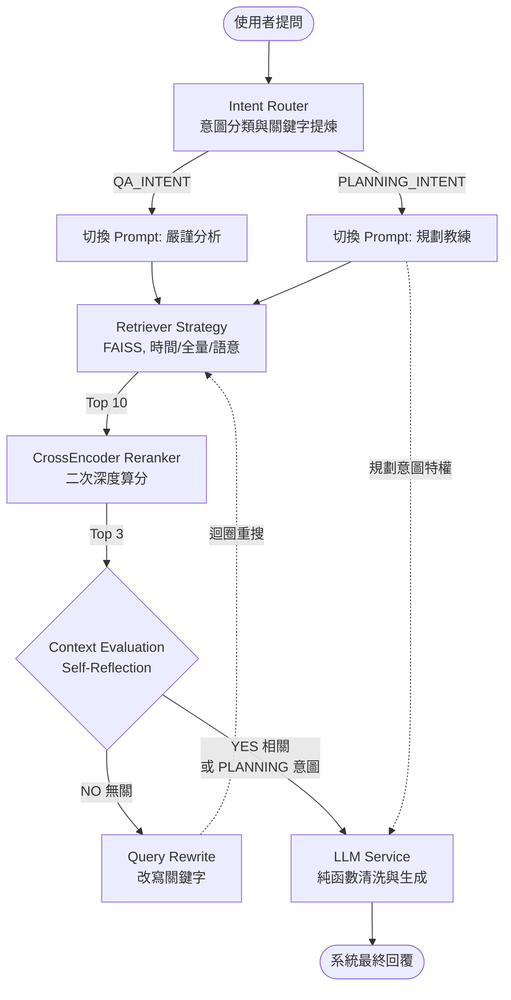

# 🏋️ RAG 健身教練系統 (Agentic RAG Fitness Coach)

> 結合本地隱私檢索、Agentic Workflow 與自適應意圖路由的次世代 AI 健身顧問

本專案從一個基礎的 RAG (Retrieval-Augmented Generation) 專案，逐步迭代為具備**「意圖分類 (Intent Classification)」**、**「兩階段檢索 (Two-Stage Retrieval)」**與**「自我反思重搜 (Self-Reflection & Query Rewrite)」**的企業級 Agentic RAG 架構。將使用者的私密健身訓練紀錄向量化後存於本地 FAISS 索引，不僅能精準回覆過去的訓練表現，還能化身專業教練為您量身打造未來課表。

## ✨ 特色功能

- 🔒 **隱私優先**：文檔解析、切塊與 FAISS 向量搜尋 100% 在本地運行，支援本機 GPU (CUDA) 加速，完美保護個人資料。
- 🧭 **大模型意圖路由 (Intent-Based Semantic Routing)**：捨棄傳統的正則表達式。透過 LLM 結構化輸出分析使用者意圖，動態切換 `QA_INTENT` (嚴謹的歷史數據查詢) 與 `PLANNING_INTENT` (生成未來的訓練菜單) 兩大模式。
- 🎯 **兩階段檢索 (Two-Stage Retrieval)**：
  - **初階召回**：透過 FAISS 放大召回率抓出 Top 10 候選資料。
  - **CrossEncoder 重排序**：導入 `bge-reranker-base` 進行深度語意打分，精準截取關聯度最高的 Top 3 餵給生成 LLM，徹底抑制雜訊。
- 🔄 **Agentic Workflow (代理工作流)**：導入嚴密的「Self-Reflection (自我反思)」檢測。若檢索結果被判定與問題無關，將自動觸發「Query Rewrite (查詢改寫)」機制，更換關鍵字並重新檢索，大幅降低模型產生幻覺 (Hallucination) 的機率。
- 🧪 **LLM-as-a-Judge 自動量化評估**：內建自動化測試腳本，針對 Context Precision (精準度), Faithfulness (忠誠度) 與 Answer Relevance (相關度) 進行嚴格的客觀打分驗證。
- 🧱 **SOLID 多模型切換工廠 (LLM Factory)**：落實依賴反轉原則。可無縫從介面一鍵切換 Groq (Llama-3), OpenAI (GPT-4o) 以及 Ollama (本地開源模型)。

## 🛠️ 技術堆疊

| 領域 | 使用技術 / 套件 |
|------|-------------------|
| **核心框架** | [LangChain](https://python.langchain.com/) |
| **嵌入與重排序** | BAAI/bge-small-zh-v1.5 (Embedding), BAAI/bge-reranker-base (CrossEncoder) |
| **向量資料庫** | [FAISS](https://github.com/facebookresearch/faiss) (CPU) |
| **雲端 / 本地 LLM** | Groq, OpenAI, Ollama |
| **後端 API** | [FastAPI](https://fastapi.tiangolo.com/) (含 StaticFiles 靜態部署) |
| **前端介面** | React 18 + Tailwind CSS (Glassmorphism SPA) |

## 📁 專案結構

```
rag-fitness-coach/
├── data/
│   ├── Train.txt            # 你的健身紀錄（文字格式）
│   ├── *.pdf                # 你的參考書籍與教練手冊（PDF 格式）
│   └── faiss_index/         # FAISS 索引（由 indexer 產出）
├── src/
│   ├── api/                 # FastAPI 伺服器與路由 (endpoints, server)
│   ├── config/              # 環境變數與全域設定 (settings)
│   ├── models/              # Pydantic 資料綱要 (schemas)
│   ├── services/            # 核心 Agentic RAG 商業邏輯 (workflow, router, llm, factory...)
│   ├── static/
│   │   └── index.html       # React + Tailwind CSS Glassmorphism 前端 SPA
│   └── indexer.py           # 向量化與建立 FAISS 索引的 ETL 腳本
├── tests/
│   └── evaluate_rag.py      # LLM-as-a-Judge 自動量化評估腳本
├── main.py                  # 啟動 FastAPI 伺服器 (同時 Serve 前端 + API)
├── Dockerfile               # 生產環境容器化部署
├── .env.example             # 環境變數範本
├── requirements.txt
└── README.md
```

## 🚀 快速開始

### 1. 安裝依賴

```bash
pip install -r requirements.txt
```

### 2. 設定環境變數

```bash
cp .env.example .env
# 編輯 .env，填入你的 Groq API Key
```

> 前往 [Groq Console](https://console.groq.com/) 免費取得 API Key

### 3. 準備你的訓練紀錄

將你的健身紀錄或參考書籍放入 `data/` 資料夾，目前支援：
- **純文字 (.txt, .json)**：例如傳統用 Line 紀錄的訓練日誌。
- **文件檔案 (.pdf)**：自動使用 PyPDF 提取並拆解內容。

放入資料夾後，系統會自動幫你執行 Token 向量化。

### 4. 建立索引

請使用 module 模式執行，以確保 Python 能夠抓到模組路徑：

```bash
python -m src.indexer
```

### 5. 啟動服務

一個指令同時啟動 FastAPI 後端 API 與 React Glassmorphism 前端：

```bash
python main.py
```

打開瀏覽器前往 **`http://localhost:7860`** 即可使用。

> 前端介面由 FastAPI `StaticFiles` 直接提供服務，無需額外啟動前端伺服器。

## 💬 使用範例

| 問題 | 意圖大類 | 檢索策略與管線 |
|------|------|----------|
| 我壓肩做過最重幾公斤？ | `QA_INTENT` | 時間意圖 → 兩階段語意搜尋 → LLM 嚴格反思驗證 |
| 我的胸推有進步嗎？ | `QA_INTENT` | FAISS 語意搜尋 → CrossEncoder 重排 → 趨勢分析 |
| 幫我安排明天下半身的菜單 | `PLANNING_INTENT`| FAISS 抓取近期實力 → 跳過反思檢驗 → 動態切換教練 Prompt |

## 📐 架構圖 (Agentic RAG Pipeline)



## 🌟 開發史：從 MVP 到企業級架構演進

本專案實現了從「簡易 MVP 腳本」跨入「企業級架構」的八大重構里程碑：

1. **模組化重構 (Modular Architecture)**
   - 將原本肥大的單一檔案拆分為標準 `src/` 領域驅動架構 (`api`, `services`, `models`, `config`)。
   - 全面改採 Pydantic 管理資料綱要，並實作單例模式 (Singleton) 服務降載。
2. **導入意圖路由 (LLM Intent Routing)**
   - 捨棄死板的正則表達式 (Regex) 關鍵字猜測。
   - 導入 LangChain `with_structured_output`，利用 Llama 3 毫秒級智能判斷「時間」、「統計」與「語意搜尋」意圖，並區分 QA 與 PLANNING 意圖類別。
3. **GPU 解析與防爆機制 (GPU Semantic Chanking & Payload Limits)**
   - 擴充 `pypdf` 支援，成功匯入數千頁厚重的原文生物力學與教練手冊。
   - 捨棄固定字數切割，升級為 **LangChain SemanticChunker**，並結合本機 **NVIDIA GTX 1050 Ti (CUDA 11.8)** 達成極速語意識別與 FAISS 向量建置。
   - 因應免費 API 嚴苛的限制，實作文字截斷管線徹底解決 Payload 崩潰問題。
4. **多模型切換工廠 (LLM Factory)**
   - 貫徹 SOLID 依賴反轉原則 (DIP)，將 ChatModel 初始化從核心服務中剝離。
   - 實作工廠模式，支援從前端介面一鍵切換 Groq (Llama-3), OpenAI (GPT-4o) 以及 Ollama 本地離線模型。
5. **兩階段檢索 (Two-Stage Retrieval)**
   - 導入 `sentence_transformers` 的 `CrossEncoder` (`BAAI/bge-reranker-base`)。
   - 第一階段 FAISS 擴大召回率抓取 10 筆，第二階段 CrossEncoder 進行深度語意打分重排，精準截取 Top 3 給 LLM，大幅提升抗雜訊能力。
6. **Agentic RAG 工作流 (自我反思與查詢改寫)**
   - 終結單向線性問答，實作 `AgenticWorkflow`。
   - 導入 **Self-Reflection** 評估機制：若系統判定檢索資料無關 (NO)，將自動觸發 **Query Rewrite** 改寫擴展關鍵字重新檢索，徹底避免幻覺 (Hallucination)。
7. **意圖分類與 LLM-as-a-Judge 自動量化評估**
   - 將意圖嚴格區分為 `QA_INTENT` 與 `PLANNING_INTENT`，動態切換嚴格/擴展提示詞，解決生成型任務因 RAG 限制造成的矛盾。
   - 導入 `tests/evaluate_rag.py`，利用強大模型作為裁判，針對 Context Precision, Faithfulness 與 Answer Relevance 進行自動化 0~1 的嚴格打分，為未來的實驗提供客觀量化指標。
8. **前端架構遷移 (Streamlit → React SPA + Glassmorphism)**
   - 捨棄 Streamlit 的 iFrame 限制，全面遷移至 **React 18 + Tailwind CSS** 的純靜態 SPA。
   - 設計語言採用極致 **Glassmorphism (玻璃擬態)** 風格：流體動態漸層背景、`backdrop-blur-xl` 毛玻璃容器、環境光球散射。
   - 前端由 FastAPI `StaticFiles` 直接提供服務，API 呼叫走同源 `/api/chat`，無需跨域設定。
   - 介面包含：漸層對話氣泡、User Profile 數據卡片、Sources 參考文獻展開、三點打字動畫、友善錯誤提示。

## ⚙️ 自訂設定 / 預防 API Rate Limits

由於我們使用了 Groq 免費方案，有極為嚴格的 TPM (Tokens Per Minute) 和 TPD (Tokens Per Day) 上限：
- **若使用免費金鑰 (`llama-3.1-8b-instant`)**：系統會自動截斷過長的檢索文字，確保不會觸發 `413 Request Too Large` 錯誤。
- **若使用付費版金鑰 (`llama-3.3-70b-versatile`)**：請在左側設定面板勾選「💎 付費版 Pro Key」。系統會自動解放所有上下文限制，享受完整無閹割的高智商 Agentic RAG 分析。

## 📝 License

MIT
